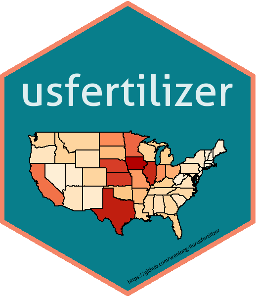

Stikcer for Usfertilizer
================

In this rep, a customed sticker was generated for an R package,
[**usfertilizer**](https://github.com/wenlong-liu/usfertilizer), which
provides county-lelel nutrients data from 1945 to 2012 in USA.



[HexSticker](https://github.com/GuangchuangYu/hexSticker), an R package
developed by Guangchuang Yu, was used to design the sticker.

## Lisence

[GPL3.0](./lisence.txt) feel free to share, edit or adapt the materials
in the repo.

## Author

[Wenlong Liu](https://wenlong-liu.github.io/)

## How to generate a sticker like this

The following content will show how to generate this stikcer
step-by-step.

### Import libraries.

``` r
require(hexSticker)
require(usfertilizer)
require(ggplot2)
require(RColorBrewer)
require(dplyr)
# import fertilizer data.
data("us_fertilizer_county")
```

### prepare for the ggplot map of nitrogen application in US.

``` r
# Generate potential plots.
states <- map_data("state")
# set color map
colors = brewer.pal(5,"OrRd")

# summarize the Nitrogen application in all the states in 2000.
N_states = us_fertilizer_county %>% 
  filter(Year == 2000 & Farm.Type == "farm" & 
           Nutrient == "N" & Input.Type == "Fertilizer")  %>% 
  group_by(State) %>% 
  summarise(N_application =round( sum(Quantity, na.rm = TRUE)/10^6,2)) %>% 
  rowwise() %>% 
  mutate(region = tolower(state.name[grep(State, state.abb)]))
  
# add the fertilizer quantity to existing states data and plot them.
state_plot = states %>% 
  left_join(N_states, by = 'region') %>% 
  ggplot() + 
  geom_polygon(aes(x = long, y = lat, 
                   fill = N_application, group = group), 
                   color = "black", size = 0.3) + 
  scale_fill_gradientn(colors = colors)+
  scale_x_continuous(breaks = NULL) + 
  scale_y_continuous(breaks = NULL) +
  labs(x = "", y = "") +
  coord_fixed(1.3) +
  theme_void() + theme_transparent()+
  theme(legend.position = "none",
        panel.background = element_blank())
```

### generate sticker

``` r
# color theme:https://coolors.co/db5461-175676-000000-087e8b-f48668
sticker(state_plot, 
        package = "usfertilizer", 
        p_size = 23, 
        p_color = "#FFFFFFDD",
        s_x = 1,
        s_y=.75, 
        s_width=1.5, 
        s_height=1.1,
        h_fill = "#087E8B",
        h_color = "#F48668",
        filename="./usfertilizer.png",
        url = "https://github.com/wenlong-liu/usfertilizer",
        u_size = 3)
```
